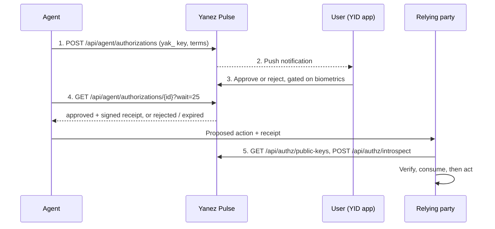

# Yanez Pulse: Agent Authorization

Let an AI agent request **verifiable human approval** for a sensitive action, and let the
action's executor (the relying party) verify the signed receipt before anything runs.

The HTTP/OpenAPI contract is the source of truth. Every SDK, the CLI, the MCP server, and
the skill are adapters over that same contract — pick the highest layer your runtime
supports.

!!! note "The one rule that matters"

    A receipt authorizes nothing by itself. The **action executor** (the relying
    party, not the agent) must verify **both signatures** — Yanez's, and the approver's
    own — compare the signed terms against the proposed action, apply its own freshness and
    assurance policy, and consume single-use receipts.

## How it works

1. **The agent creates a request.** It sends the exact `terms` to Yanez Pulse with its
    `yak_` agent API key. The key can ask, not act.
2. **Yanez Pulse notifies the user.** A push notification reaches the user's device.
3. **The user decides.** They approve or reject in the YID app, gated on a fresh biometric
    scan. Their own key signs the decision, and approval produces a receipt carrying both
    that signature and Yanez's: [user-signed approvals](user-signed-approvals.md).
4. **The agent polls for the decision.** It long-polls the request until it is `approved`
    (with the receipt), `rejected`, or `expired`.
5. **The relying party checks the receipt.** The action executor verifies Yanez's signature
    offline against Yanez's public keys and the approver's signature against the key inside
    the receipt, compares the signed terms with the proposed action, consumes the receipt
    when the action is single-use, and only then acts.

## Start here

Two ways in. Pick one.

-   **Let an AI agent integrate it**

    ---

    Paste one prompt into Claude Code, Cursor, Codex, or a chat assistant. It reads llms.txt and wires the integration in.

    [:octicons-arrow-right-24: Use with AI agents](ai-agents.md)

-   **Integrate it yourself**

    ---

    Python, TypeScript, CLI + skill, MCP, or raw HTTP. Pick the highest layer your runtime supports, then follow its quickstart.

    [:octicons-arrow-right-24: Choosing an integration path](integration-options.md)

## Understand the model

-   **Terms**

    ---

    The object the human actually approves, field by field.

    [:octicons-arrow-right-24: Terms](terms.md)

-   **Receipts**

    ---

    What the signed artifact contains, how it is signed, and how its keys rotate.

    [:octicons-arrow-right-24: Receipts](receipts.md)

-   **User-signed approvals**

    ---

    The approver's own signature: what changed in the schema, and the steps to verify both signatures.

    [:octicons-arrow-right-24: User-signed approvals](user-signed-approvals.md)

-   **Action enforcement**

    ---

    The contract for the boundary where a receipt is turned into an action.

    [:octicons-arrow-right-24: Action enforcement](action-enforcement.md)

