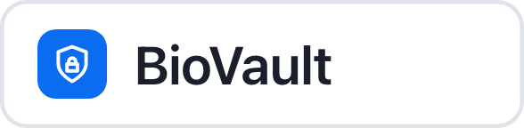

# Showcase

Apps built on the YID registry: agents that ask a human for approval through **Yanez Pulse**, and
partner apps that verify people with YID.

## Agents on Pulse

<ul class="showcase">
  <li>
    
    Ask the Agent what you want to buy
  </li>
  <li>
    
    Let your agent spend. Never hand it your keys.
  </li>
  <li>
    
    Biometric approval for a robotics purchase <a class="showcase-more" href="../../assets/showcase/itkan-dashboard.png" data-popup="image">Dashboard</a>
  </li>
</ul>

## Partner Apps Powered By YID

<ul class="showcase">
  <li>
    
    Source and synthesize data into high-performance AI assets
  </li>
  <li>
    
    Dollars within reach for everyone
  </li>
  <li>
    
    Your face is your key
  </li>
</ul>

<dialog class="showcase-popup" id="showcase-popup" aria-label="Showcase media">
  <button type="button" class="showcase-close" aria-label="Close">&times;</button>
  

</dialog>

## Add your agent

Built something with Pulse? Add an image to `docs/assets/showcase/` in the docs repository and a row to
[`docs/pulse/showcase.md`](https://github.com/yanez-compliance/docs-yanez-ai/blob/main/docs/pulse/showcase.md), then open a pull request.
